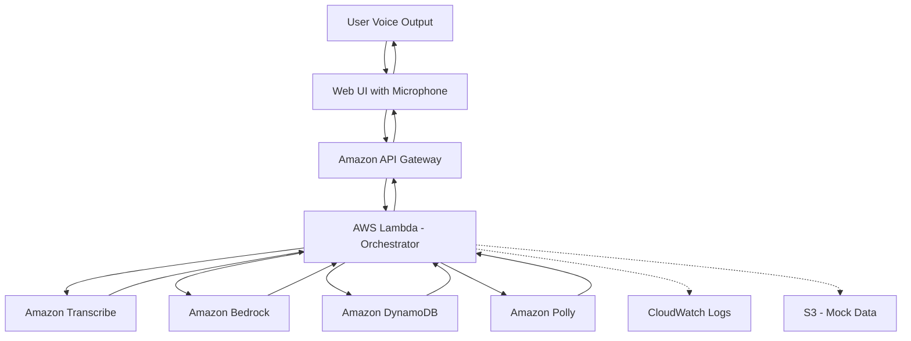

# Design Document: Sahayak AI

## Overview

Sahayak AI is a voice-first, multilingual AI assistant that enables citizens to access government services through natural conversation. The system is built entirely on AWS services, leveraging Amazon Bedrock for natural language understanding and response generation, Amazon Transcribe for speech-to-text conversion, and Amazon Polly for text-to-speech synthesis.

This design prioritizes accessibility, scalability, and public impact in India. The system is implemented as a working prototype that demonstrates how AI can democratize access to government services for low-literacy and rural populations. The MVP focuses on Hindi and English languages with 5-6 government schemes using mock data to demonstrate core functionality without requiring government API integration.

### Design Principles

1. **Voice-First**: All interactions happen through voice - no visual interface required
2. **AWS-Native**: Leverage AWS managed services for reliability, scalability, and reduced operational overhead
3. **AI-Powered**: Use Amazon Bedrock for intelligent intent understanding and natural response generation
4. **Simplicity**: Use plain language and straightforward conversation flows
5. **Accessibility**: Design for users with limited literacy and technology experience
6. **Modularity**: Separate components for easy testing and future enhancement
7. **Graceful Degradation**: Handle errors without breaking the user experience
8. **Cultural Sensitivity**: Respect linguistic and cultural norms
9. **Scalability**: Design for growth from MVP to production scale
10. **Public Impact**: Prioritize features that maximize social benefit

## Architecture

### High-Level AWS Architecture



### AWS-Based MVP Architecture

The system follows a serverless architecture pattern using AWS managed services:

1. **Frontend (Web UI)**:
   - Simple HTML/JavaScript interface with microphone input
   - Captures audio from user's device
   - Sends audio to backend via API Gateway
   - Plays audio responses received from backend
   - Hosted on Amazon S3 + CloudFront for global distribution

2. **Amazon API Gateway**:
   - RESTful API endpoint for voice interactions
   - Handles authentication and request validation
   - Routes requests to AWS Lambda
   - Manages CORS for web client access
   - Provides request/response logging

3. **AWS Lambda (Backend Orchestrator)**:
   - Serverless compute for business logic
   - Orchestrates calls to Transcribe, Bedrock, Polly, and DynamoDB
   - Manages conversation state and context
   - Implements error handling and retry logic
   - Scales automatically based on demand
   - Written in Python 3.11 using boto3 SDK

4. **Amazon Transcribe**:
   - Converts user's voice input to text
   - Supports Hindi and English languages
   - Provides confidence scores for transcriptions
   - Handles background noise and audio quality issues
   - Real-time streaming or batch processing modes

5. **Amazon Bedrock**:
   - Core AI engine for natural language understanding
   - Determines user intent from transcribed text
   - Generates natural, contextual responses
   - Handles multi-turn conversations with context
   - Uses Claude 3 or similar foundation model
   - Invoked via AWS SDK from Lambda
   - Receives prompts with conversation history and scheme data
   - Returns structured responses with intent and generated text

6. **Amazon DynamoDB**:
   - NoSQL database for scheme information
   - Stores government scheme details (eligibility, procedures, documents)
   - Stores mock application status records
   - Maintains conversation session state
   - Provides fast, scalable data access
   - Single-digit millisecond latency

7. **Amazon Polly**:
   - Converts text responses to natural-sounding speech
   - Supports Hindi (Aditi voice) and English (Raveena/Joanna voices)
   - Neural TTS for more natural pronunciation
   - Adjustable speech rate and volume
   - Returns audio stream to user via API Gateway

8. **Amazon S3**:
   - Stores mock scheme data (JSON files) for MVP
   - Hosts static web UI files
   - Stores conversation logs for analysis (optional)
   - Provides durable, scalable storage

9. **Amazon CloudWatch**:
   - Centralized logging for all Lambda functions
   - Metrics and monitoring for system health
   - Alarms for error rates and latency
   - Dashboards for operational visibility

### End-to-End User Flow

Here's how a user's voice query flows through the AWS architecture:

1. **User Speaks**: User clicks microphone button in web UI and speaks their question in Hindi or English
   - Example: "मुझे राशन कार्ड के बारे में बताइए" (Tell me about ration card)

2. **Audio Capture**: Web UI captures audio and sends it to API Gateway as base64-encoded data
   - POST request to `/api/query` endpoint
   - Includes session ID for conversation tracking

3. **Lambda Receives Request**: API Gateway invokes Lambda function with audio payload
   - Lambda extracts audio data and session information
   - Retrieves conversation context from DynamoDB (if existing session)

4. **Speech-to-Text**: Lambda calls Amazon Transcribe to convert audio to text
   - Uses `start_transcription_job` or streaming API
   - Specifies language (Hindi or English, auto-detected if needed)
   - Receives transcribed text: "मुझे राशन कार्ड के बारे में बताइए"

5. **Intent Understanding via Bedrock**: Lambda constructs a prompt and sends it to Amazon Bedrock
   - Prompt includes:
     - Transcribed user query
     - Conversation history (last 3-5 turns)
     - Available government schemes (from DynamoDB)
     - Instructions for intent classification and response generation
   - Example prompt structure:
     ```
     You are Sahayak AI, a helpful assistant for Indian government services.
     
     User query: "मुझे राशन कार्ड के बारे में बताइए"
     Language: Hindi
     
     Available schemes: [list of schemes from database]
     
     Tasks:
     1. Identify the user's intent (eligibility_check, scheme_info, application_procedure, etc.)
     2. Extract relevant entities (scheme name, demographics, etc.)
     3. Generate a helpful response in Hindi using simple language
     
     Respond in JSON format with: intent, entities, response_text
     ```
   - Bedrock returns structured response with intent and generated text

6. **Data Retrieval**: Lambda queries DynamoDB for detailed scheme information
   - Uses intent and entities from Bedrock to construct query
   - Retrieves scheme details, eligibility criteria, documents, etc.
   - For MVP: Falls back to S3 JSON files if DynamoDB not populated

7. **Response Enhancement**: Lambda enriches Bedrock's response with specific data
   - Adds contact information, document lists, step-by-step procedures
   - Formats response for voice output (short sentences, clear structure)
   - Maintains conversation context for follow-up questions

8. **Text-to-Speech**: Lambda calls Amazon Polly to convert response to audio
   - Selects appropriate voice (Aditi for Hindi, Raveena for English)
   - Uses neural engine for natural pronunciation
   - Receives audio stream (MP3 or PCM format)

9. **Response Delivery**: Lambda returns audio to API Gateway, which sends it to web UI
   - Response includes audio data (base64-encoded)
   - Includes text transcript for accessibility
   - Updates session state in DynamoDB

10. **User Hears Response**: Web UI plays audio response to user
    - User can ask follow-up questions
    - Conversation context is maintained across turns

### Bedrock Integration Details

Amazon Bedrock is the core intelligence layer of Sahayak AI. Here's how it's integrated:

**Model Selection**:
- Primary: Anthropic Claude 3 Sonnet (balance of capability and cost)
- Fallback: Amazon Titan Text Express (for simpler queries)
- Model selection based on query complexity

**Prompt Engineering**:
- System prompt defines Sahayak AI's role and behavior
- User prompt includes query, context, and available data
- Few-shot examples for intent classification
- Structured output format (JSON) for parsing

**Intent Classification via Bedrock**:
- Instead of rule-based classifier, Bedrock determines intent from natural language
- Handles ambiguous queries better than keyword matching
- Supports complex, multi-intent queries
- Extracts entities (scheme names, demographics) automatically

**Response Generation via Bedrock**:
- Generates natural, contextual responses in user's language
- Adapts tone and complexity based on user's literacy level
- Incorporates scheme data seamlessly into conversational responses
- Handles follow-up questions with conversation history

**Fallback Strategy**:
- For MVP simplicity, rule-based logic can be used as fallback
- If Bedrock is unavailable or returns low-confidence results
- Simple keyword matching for common intents
- Template-based responses for known queries
- Ensures system remains functional even if AI service has issues

**Cost Optimization**:
- Cache common queries and responses
- Use smaller models for simple queries
- Batch processing where possible
- Monitor token usage and optimize prompts

## Components and Interfaces

### 1. Web UI (Frontend)

**Responsibility**: Provide voice input/output interface for users

**Technology**: HTML5, JavaScript, Web Audio API

**Interface**:
```javascript
// User initiates voice input
function startRecording() {
  // Capture audio from microphone
  // Display recording indicator
}

// Send audio to backend
async function sendAudioQuery(audioBlob, sessionId) {
  const base64Audio = await blobToBase64(audioBlob);
  const response = await fetch(API_ENDPOINT, {
    method: 'POST',
    headers: { 'Content-Type': 'application/json' },
    body: JSON.stringify({
      audio: base64Audio,
      sessionId: sessionId,
      language: 'auto' // or 'hi', 'en'
    })
  });
  return response.json();
}

// Play audio response
function playAudioResponse(base64Audio) {
  const audio = new Audio('data:audio/mp3;base64,' + base64Audio);
  audio.play();
}
```

**Features**:
- Microphone permission handling
- Visual feedback during recording and processing
- Audio playback controls
- Session management (generate/maintain session ID)
- Error display for connectivity issues
- Accessibility features (keyboard navigation, screen reader support)

**Deployment**:
- Static files hosted on Amazon S3
- Distributed via Amazon CloudFront for low latency
- HTTPS enabled for secure audio transmission

### 2. Amazon API Gateway

**Responsibility**: Expose RESTful API for voice interactions

**Endpoints**:

```
POST /api/query
Request:
{
  "audio": "base64-encoded audio data",
  "sessionId": "uuid-v4",
  "language": "hi" | "en" | "auto"
}

Response:
{
  "audio": "base64-encoded audio response",
  "text": "transcribed response text",
  "sessionId": "uuid-v4",
  "intent": "scheme_info",
  "confidence": 0.95
}

POST /api/session/new
Response:
{
  "sessionId": "uuid-v4"
}

GET /api/health
Response:
{
  "status": "healthy",
  "timestamp": "2024-01-15T10:30:00Z"
}
```

**Configuration**:
- Request validation (max audio size: 10MB)
- CORS enabled for web UI domain
- API key or Cognito authentication (optional for MVP)
- Request/response logging to CloudWatch
- Throttling: 100 requests per second per IP
- Timeout: 30 seconds

### 3. AWS Lambda (Orchestrator)

**Responsibility**: Coordinate all AWS services and implement business logic

**Function Signature**:
```python
def lambda_handler(event, context):
    """
    Main Lambda handler for voice query processing
    
    Args:
        event: API Gateway event with audio data
        context: Lambda context object
        
    Returns:
        Response with audio and metadata
    """
    pass
```

**Core Logic Flow**:
```python
import boto3
import json
import base64
from typing import Dict, Any

# Initialize AWS clients
transcribe_client = boto3.client('transcribe')
bedrock_client = boto3.client('bedrock-runtime')
polly_client = boto3.client('polly')
dynamodb = boto3.resource('dynamodb')

def lambda_handler(event, context):
    try:
        # 1. Extract request data
        body = json.loads(event['body'])
        audio_data = base64.b64decode(body['audio'])
        session_id = body['sessionId']
        language_hint = body.get('language', 'auto')
        
        # 2. Transcribe audio to text
        transcription = transcribe_audio(audio_data, language_hint)
        user_text = transcription['text']
        detected_language = transcription['language']
        
        # 3. Get conversation context
        context = get_conversation_context(session_id)
        
        # 4. Call Bedrock for intent and response
        bedrock_response = invoke_bedrock(
            user_text=user_text,
            language=detected_language,
            context=context,
            schemes=get_schemes_from_db()
        )
        
        intent = bedrock_response['intent']
        entities = bedrock_response['entities']
        response_text = bedrock_response['response_text']
        
        # 5. Enhance response with specific data (if needed)
        if intent == 'scheme_info':
            scheme_details = get_scheme_details(entities['scheme_name'])
            response_text = enhance_response(response_text, scheme_details)
        
        # 6. Convert response to speech
        audio_response = synthesize_speech(response_text, detected_language)
        
        # 7. Update conversation context
        update_conversation_context(session_id, user_text, response_text, intent)
        
        # 8. Return response
        return {
            'statusCode': 200,
            'headers': {
                'Content-Type': 'application/json',
                'Access-Control-Allow-Origin': '*'
            },
            'body': json.dumps({
                'audio': base64.b64encode(audio_response).decode('utf-8'),
                'text': response_text,
                'sessionId': session_id,
                'intent': intent,
                'confidence': bedrock_response.get('confidence', 0.0)
            })
        }
        
    except Exception as e:
        return handle_error(e, session_id)
```

**Key Functions**:

```python
def transcribe_audio(audio_data: bytes, language_hint: str) -> Dict[str, Any]:
    """
    Transcribe audio using Amazon Transcribe
    
    For MVP: Use StartTranscriptionJob with S3 upload
    For production: Use streaming API for real-time transcription
    """
    # Upload audio to S3
    s3_key = f"audio-input/{uuid.uuid4()}.wav"
    s3_client.put_object(Bucket=AUDIO_BUCKET, Key=s3_key, Body=audio_data)
    
    # Start transcription job
    job_name = f"transcribe-{uuid.uuid4()}"
    transcribe_client.start_transcription_job(
        TranscriptionJobName=job_name,
        Media={'MediaFileUri': f's3://{AUDIO_BUCKET}/{s3_key}'},
        MediaFormat='wav',
        LanguageCode='hi-IN' if language_hint == 'hi' else 'en-IN',
        Settings={
            'ShowAlternatives': True,
            'MaxAlternatives': 2
        }
    )
    
    # Wait for completion (polling)
    while True:
        status = transcribe_client.get_transcription_job(
            TranscriptionJobName=job_name
        )
        if status['TranscriptionJob']['TranscriptionJobStatus'] in ['COMPLETED', 'FAILED']:
            break
        time.sleep(0.5)
    
    # Extract transcription
    transcript_uri = status['TranscriptionJob']['Transcript']['TranscriptFileUri']
    transcript_data = requests.get(transcript_uri).json()
    
    return {
        'text': transcript_data['results']['transcripts'][0]['transcript'],
        'language': 'hi' if 'hi-IN' in language_hint else 'en',
        'confidence': transcript_data['results']['items'][0]['alternatives'][0]['confidence']
    }

def invoke_bedrock(user_text: str, language: str, context: Dict, schemes: list) -> Dict[str, Any]:
    """
    Call Amazon Bedrock for intent understanding and response generation
    """
    # Construct prompt
    prompt = f"""You are Sahayak AI, a helpful assistant for Indian government services.
You help citizens understand government schemes, eligibility, and application procedures.
Use simple language appropriate for users with limited literacy.

Conversation History:
{format_conversation_history(context)}

Available Government Schemes:
{format_schemes_list(schemes)}

User Query: "{user_text}"
Language: {"Hindi" if language == 'hi' else "English"}

Tasks:
1. Identify the user's intent from these options:
   - eligibility_check: User asking if they qualify for schemes
   - scheme_info: User asking about a specific scheme
   - application_procedure: User asking how to apply
   - document_inquiry: User asking about required documents
   - status_check: User asking about application status
   - general_help: User needs guidance
   - clarification_needed: Intent unclear

2. Extract relevant entities:
   - scheme_name: Name of government scheme mentioned
   - age: User's age (if mentioned)
   - income: User's income (if mentioned)
   - location: User's location (if mentioned)
   - application_ref: Application reference number (if mentioned)

3. Generate a helpful response in {"Hindi" if language == 'hi' else "English"}:
   - Use simple, conversational language
   - Keep sentences short (max 15 words)
   - Provide specific, actionable information
   - Be empathetic and encouraging
   - If information is missing, ask clarifying questions

Respond in JSON format:
{{
  "intent": "intent_type",
  "entities": {{"entity_name": "value"}},
  "response_text": "your response here",
  "confidence": 0.0-1.0,
  "follow_up_questions": ["optional", "suggested", "questions"]
}}
"""
    
    # Call Bedrock
    response = bedrock_client.invoke_model(
        modelId='anthropic.claude-3-sonnet-20240229-v1:0',
        contentType='application/json',
        accept='application/json',
        body=json.dumps({
            'anthropic_version': 'bedrock-2023-05-31',
            'max_tokens': 1000,
            'messages': [
                {
                    'role': 'user',
                    'content': prompt
                }
            ],
            'temperature': 0.7,
            'top_p': 0.9
        })
    )
    
    # Parse response
    response_body = json.loads(response['body'].read())
    content = response_body['content'][0]['text']
    
    # Extract JSON from response
    bedrock_result = json.loads(content)
    
    return bedrock_result

def synthesize_speech(text: str, language: str) -> bytes:
    """
    Convert text to speech using Amazon Polly
    """
    voice_id = 'Aditi' if language == 'hi' else 'Raveena'  # Indian English voice
    
    response = polly_client.synthesize_speech(
        Text=text,
        OutputFormat='mp3',
        VoiceId=voice_id,
        Engine='neural',  # Use neural engine for better quality
        LanguageCode='hi-IN' if language == 'hi' else 'en-IN',
        TextType='text'
    )
    
    return response['AudioStream'].read()
```

**Environment Variables**:
```
DYNAMODB_TABLE_SCHEMES=sahayak-schemes
DYNAMODB_TABLE_SESSIONS=sahayak-sessions
AUDIO_BUCKET=sahayak-audio-input
BEDROCK_MODEL_ID=anthropic.claude-3-sonnet-20240229-v1:0
LOG_LEVEL=INFO
```

**IAM Permissions**:
- `transcribe:StartTranscriptionJob`, `transcribe:GetTranscriptionJob`
- `bedrock:InvokeModel`
- `polly:SynthesizeSpeech`
- `dynamodb:GetItem`, `dynamodb:PutItem`, `dynamodb:Query`
- `s3:PutObject`, `s3:GetObject`
- `logs:CreateLogGroup`, `logs:CreateLogStream`, `logs:PutLogEvents`

### 4. Amazon Transcribe Integration

**Responsibility**: Convert user's voice input to text

**Configuration**:
```python
# Language support
SUPPORTED_LANGUAGES = {
    'hi': 'hi-IN',  # Hindi (India)
    'en': 'en-IN'   # English (India)
}

# Transcription settings
TRANSCRIBE_SETTINGS = {
    'ShowSpeakerLabels': False,
    'MaxSpeakerLabels': 1,
    'ShowAlternatives': True,
    'MaxAlternatives': 2,
    'VocabularyName': 'government-schemes-vocab'  # Custom vocabulary for scheme names
}
```

**Custom Vocabulary**:
- Create custom vocabulary for government scheme names
- Include common Hindi terms for government services
- Improve accuracy for domain-specific terms
- Examples: "राशन कार्ड", "पेंशन", "आयुष्मान भारत", "PM-KISAN"

**Error Handling**:
- Low confidence (<0.6): Return error, request user to repeat
- No speech detected: Return error with helpful message
- Unsupported language: Return error, inform about supported languages
- Timeout: Cancel job after 30 seconds

### 5. Amazon Bedrock Integration

**Responsibility**: Natural language understanding and response generation

**Model Configuration**:
```python
BEDROCK_CONFIG = {
    'primary_model': 'anthropic.claude-3-sonnet-20240229-v1:0',
    'fallback_model': 'amazon.titan-text-express-v1',
    'max_tokens': 1000,
    'temperature': 0.7,
    'top_p': 0.9,
    'stop_sequences': ['</response>']
}
```

**Prompt Templates**:

```python
SYSTEM_PROMPT = """You are Sahayak AI, a compassionate and helpful assistant for Indian government services.

Your role:
- Help citizens understand government schemes and benefits
- Explain eligibility criteria in simple terms
- Guide users through application processes
- Answer questions about required documents
- Check application status

Your communication style:
- Use simple language (5th grade reading level)
- Keep sentences short (max 15 words)
- Be patient and encouraging
- Show empathy for user's situation
- Use culturally appropriate greetings and phrases
- Avoid technical jargon
- Provide specific, actionable information

When you don't know something:
- Be honest about limitations
- Suggest alternative resources
- Offer to help with related questions

Remember: Many users have limited literacy and technology experience. Your goal is to make government services accessible to everyone.
"""

INTENT_CLASSIFICATION_PROMPT = """Based on the user's query, identify their intent and extract relevant entities.

User Query: "{user_text}"

Classify intent as one of:
1. eligibility_check - User wants to know if they qualify for schemes
2. scheme_info - User wants information about a specific scheme
3. application_procedure - User wants to know how to apply
4. document_inquiry - User wants to know required documents
5. status_check - User wants to check application status
6. general_help - User needs general guidance
7. clarification_needed - Intent is unclear

Extract entities:
- scheme_name: Name of scheme mentioned
- age: User's age
- income: Annual income
- location: City/state
- category: Social category (general, SC, ST, OBC)
- application_ref: Application reference number

Respond in JSON format.
"""

RESPONSE_GENERATION_PROMPT = """Generate a helpful response for the user.

Intent: {intent}
Entities: {entities}
Scheme Data: {scheme_data}
Conversation History: {history}

Requirements:
- Respond in {language}
- Use simple, conversational language
- Keep sentences short
- Provide specific information
- Be encouraging and supportive
- If information is incomplete, ask clarifying questions

Generate response:
"""
```

**Intent Classification Logic**:
- Bedrock analyzes user query and returns structured intent
- Confidence threshold: 0.7 (if lower, ask clarifying questions)
- Multi-intent handling: Prioritize primary intent, acknowledge secondary
- Entity extraction: Use Bedrock's natural language understanding

**Response Generation Logic**:
- Bedrock generates natural language response based on intent and data
- Incorporates conversation history for context
- Adapts language complexity based on user's queries
- Includes follow-up suggestions to guide conversation

**Fallback to Rule-Based Logic** (MVP Simplicity):
```python
def fallback_intent_classifier(text: str, language: str) -> Dict[str, Any]:
    """
    Simple rule-based classifier as fallback when Bedrock is unavailable
    """
    text_lower = text.lower()
    
    # Keyword patterns for each intent
    patterns = {
        'eligibility_check': ['eligible', 'qualify', 'पात्र', 'योग्य'],
        'scheme_info': ['about', 'tell me', 'what is', 'के बारे में', 'क्या है'],
        'application_procedure': ['apply', 'how to', 'process', 'आवेदन', 'कैसे'],
        'document_inquiry': ['document', 'papers', 'दस्तावेज', 'कागजात'],
        'status_check': ['status', 'check', 'स्थिति', 'जांच']
    }
    
    for intent, keywords in patterns.items():
        if any(keyword in text_lower for keyword in keywords):
            return {'intent': intent, 'confidence': 0.8}
    
    return {'intent': 'clarification_needed', 'confidence': 0.5}

def fallback_response_generator(intent: str, entities: Dict, language: str) -> str:
    """
    Template-based response generation as fallback
    """
    templates = {
        'scheme_info': {
            'hi': 'मैं आपको {scheme_name} के बारे में बता सकता हूं। यह योजना {benefits} प्रदान करती है।',
            'en': 'I can tell you about {scheme_name}. This scheme provides {benefits}.'
        },
        'clarification_needed': {
            'hi': 'क्षमा करें, मैं समझ नहीं पाया। क्या आप फिर से बता सकते हैं?',
            'en': 'Sorry, I did not understand. Can you please repeat?'
        }
    }
    
    template = templates.get(intent, templates['clarification_needed'])[language]
    return template.format(**entities)
```

### 6. Amazon DynamoDB Schema

**Responsibility**: Store scheme data, application status, and conversation sessions

**Table 1: Schemes**
```python
Table Name: sahayak-schemes
Partition Key: scheme_id (String)
Sort Key: None

Attributes:
{
    "scheme_id": "ration-card-pds",
    "name_en": "Public Distribution System Ration Card",
    "name_hi": "सार्वजनिक वितरण प्रणाली राशन कार्ड",
    "category": "food_security",
    "description_en": "Subsidized food grains for low-income families",
    "description_hi": "कम आय वाले परिवारों के लिए सब्सिडी वाले खाद्यान्न",
    "eligibility_criteria": [
        {
            "field": "income",
            "operator": "<=",
            "value": 100000,
            "description_en": "Annual family income below 1 lakh rupees",
            "description_hi": "वार्षिक पारिवारिक आय 1 लाख रुपये से कम"
        }
    ],
    "application_procedure": [
        {
            "step_number": 1,
            "description_en": "Visit your nearest ration shop or tehsil office",
            "description_hi": "अपनी निकटतम राशन की दुकान या तहसील कार्यालय पर जाएं",
            "estimated_time": "1 day"
        }
    ],
    "required_documents": [
        {
            "name_en": "Aadhaar Card",
            "name_hi": "आधार कार्ड",
            "is_mandatory": true,
            "alternatives": []
        }
    ],
    "contact_info": {
        "office_name": "District Supply Office",
        "phone": "1800-XXX-XXXX",
        "website": "https://nfsa.gov.in",
        "office_hours": "10 AM - 5 PM, Monday to Friday"
    },
    "benefits": "Subsidized rice, wheat, and sugar at affordable prices",
    "created_at": "2024-01-15T10:00:00Z",
    "updated_at": "2024-01-15T10:00:00Z"
}
```

**Table 2: Sessions**
```python
Table Name: sahayak-sessions
Partition Key: session_id (String)
Sort Key: None
TTL: expires_at (Number, Unix timestamp)

Attributes:
{
    "session_id": "uuid-v4",
    "user_id": null,  # Optional, for future authentication
    "language": "hi",
    "start_time": "2024-01-15T10:00:00Z",
    "last_activity": "2024-01-15T10:05:00Z",
    "conversation_history": [
        {
            "turn_number": 1,
            "timestamp": "2024-01-15T10:00:00Z",
            "user_input": "मुझे राशन कार्ड के बारे में बताइए",
            "intent": "scheme_info",
            "entities": {"scheme_name": "ration card"},
            "response": "राशन कार्ड एक सरकारी योजना है...",
            "audio_duration": 3.5
        }
    ],
    "current_context": {
        "last_scheme_discussed": "ration-card-pds",
        "last_intent": "scheme_info",
        "user_demographics": {
            "age": null,
            "income": null,
            "location": null
        }
    },
    "expires_at": 1705324800  # 5 minutes from last_activity
}
```

**Table 3: Application Status** (Mock Data for MVP)
```python
Table Name: sahayak-applications
Partition Key: application_ref (String)
Sort Key: None

Attributes:
{
    "application_ref": "RCN123456789",
    "scheme_id": "ration-card-pds",
    "status": "pending",  # pending, approved, rejected
    "submitted_date": "2024-01-10T10:00:00Z",
    "last_updated": "2024-01-12T14:30:00Z",
    "expected_completion": "2024-01-25T10:00:00Z",
    "notes": "Documents under verification",
    "applicant_name": "Mock User",
    "contact_phone": "98XXXXXXXX"
}
```

**DynamoDB Operations**:
```python
def get_scheme_by_id(scheme_id: str) -> Dict:
    table = dynamodb.Table('sahayak-schemes')
    response = table.get_item(Key={'scheme_id': scheme_id})
    return response.get('Item')

def find_eligible_schemes(criteria: Dict) -> List[Dict]:
    table = dynamodb.Table('sahayak-schemes')
    response = table.scan()  # For MVP, scan all schemes
    schemes = response['Items']
    
    # Filter based on criteria
    eligible = []
    for scheme in schemes:
        if check_eligibility(scheme, criteria):
            eligible.append(scheme)
    
    return eligible

def get_conversation_context(session_id: str) -> Dict:
    table = dynamodb.Table('sahayak-sessions')
    response = table.get_item(Key={'session_id': session_id})
    return response.get('Item', {})

def update_conversation_context(session_id: str, turn_data: Dict):
    table = dynamodb.Table('sahayak-sessions')
    table.update_item(
        Key={'session_id': session_id},
        UpdateExpression='SET conversation_history = list_append(conversation_history, :turn), last_activity = :now',
        ExpressionAttributeValues={
            ':turn': [turn_data],
            ':now': datetime.utcnow().isoformat()
        }
    )
```

### 7. Amazon Polly Integration

**Responsibility**: Convert text responses to natural-sounding speech

**Voice Configuration**:
```python
POLLY_VOICES = {
    'hi': {
        'voice_id': 'Aditi',
        'language_code': 'hi-IN',
        'engine': 'neural'
    },
    'en': {
        'voice_id': 'Raveena',  # Indian English accent
        'language_code': 'en-IN',
        'engine': 'neural'
    }
}

POLLY_SETTINGS = {
    'output_format': 'mp3',
    'sample_rate': '24000',
    'text_type': 'text',  # or 'ssml' for advanced control
    'speech_rate': '100%',  # Moderate pace
    'volume': 'default'
}
```

**SSML Enhancement** (Optional for better quality):
```python
def add_ssml_markup(text: str, language: str) -> str:
    """
    Add SSML tags for better speech synthesis
    """
    # Add pauses at sentence boundaries
    text = text.replace('.', '.<break time="500ms"/>')
    text = text.replace('?', '?<break time="500ms"/>')
    
    # Emphasize important terms
    text = re.sub(r'(\d+)', r'<emphasis level="strong">\1</emphasis>', text)
    
    # Wrap in SSML
    ssml = f'''<speak>
        <prosody rate="medium" pitch="medium">
            {text}
        </prosody>
    </speak>'''
    
    return ssml

def synthesize_speech_with_ssml(text: str, language: str) -> bytes:
    """
    Enhanced speech synthesis with SSML
    """
    ssml_text = add_ssml_markup(text, language)
    voice_config = POLLY_VOICES[language]
    
    response = polly_client.synthesize_speech(
        Text=ssml_text,
        OutputFormat='mp3',
        VoiceId=voice_config['voice_id'],
        Engine=voice_config['engine'],
        LanguageCode=voice_config['language_code'],
        TextType='ssml'
    )
    
    return response['AudioStream'].read()
```

**Error Handling**:
- Synthesis failure: Retry once with standard engine
- Text too long: Split into chunks and synthesize separately
- Unsupported characters: Clean text before synthesis

### 8. Error Handler

**Responsibility**: Manage errors gracefully across all AWS services

**Error Categories and Recovery**:

```python
class ErrorHandler:
    def __init__(self, session_id: str):
        self.session_id = session_id
        self.logger = logging.getLogger(__name__)
    
    def handle_error(self, error: Exception, component: str) -> Dict[str, Any]:
        """
        Central error handling with appropriate recovery strategies
        """
        error_type = type(error).__name__
        self.logger.error(f"Error in {component}: {error_type} - {str(error)}")
        
        # Transcribe errors
        if component == 'transcribe':
            if 'NoSpeechDetected' in error_type:
                return self._no_speech_error()
            elif 'LowConfidence' in error_type:
                return self._low_confidence_error()
            elif 'UnsupportedLanguage' in error_type:
                return self._unsupported_language_error()
        
        # Bedrock errors
        elif component == 'bedrock':
            if 'ThrottlingException' in error_type:
                return self._throttling_error()
            elif 'ModelNotFound' in error_type:
                return self._use_fallback_logic()
            elif 'ValidationException' in error_type:
                return self._invalid_prompt_error()
        
        # DynamoDB errors
        elif component == 'dynamodb':
            if 'ResourceNotFoundException' in error_type:
                return self._scheme_not_found_error()
            elif 'ProvisionedThroughputExceededException' in error_type:
                return self._database_busy_error()
        
        # Polly errors
        elif component == 'polly':
            if 'TextLengthExceededException' in error_type:
                return self._text_too_long_error()
            elif 'InvalidSsmlException' in error_type:
                return self._retry_without_ssml()
        
        # Generic error
        return self._generic_error()
    
    def _no_speech_error(self) -> Dict[str, Any]:
        return {
            'error': 'no_speech_detected',
            'message_hi': 'मुझे कोई आवाज़ नहीं सुनाई दी। कृपया फिर से बोलें।',
            'message_en': 'I did not hear anything. Please speak again.',
            'should_retry': True
        }
    
    def _low_confidence_error(self) -> Dict[str, Any]:
        return {
            'error': 'unclear_speech',
            'message_hi': 'मुझे आपकी बात स्पष्ट नहीं सुनाई दी। कृपया धीरे और स्पष्ट बोलें।',
            'message_en': 'I could not understand clearly. Please speak slowly and clearly.',
            'should_retry': True
        }
    
    def _use_fallback_logic(self) -> Dict[str, Any]:
        return {
            'error': 'bedrock_unavailable',
            'action': 'use_fallback',
            'message': 'Using rule-based logic as fallback'
        }
    
    def _scheme_not_found_error(self) -> Dict[str, Any]:
        return {
            'error': 'scheme_not_found',
            'message_hi': 'क्षमा करें, मुझे इस योजना की जानकारी नहीं है। क्या आप कोई अन्य योजना के बारे में जानना चाहते हैं?',
            'message_en': 'Sorry, I do not have information about this scheme. Would you like to know about other schemes?',
            'should_retry': False
        }
    
    def _generic_error(self) -> Dict[str, Any]:
        return {
            'error': 'system_error',
            'message_hi': 'क्षमा करें, कुछ गड़बड़ हो गई। कृपया थोड़ी देर बाद फिर से कोशिश करें।',
            'message_en': 'Sorry, something went wrong. Please try again later.',
            'should_retry': True
        }
```

**Retry Logic**:
```python
def retry_with_exponential_backoff(func, max_retries=3, base_delay=1):
    """
    Retry function with exponential backoff
    """
    for attempt in range(max_retries):
        try:
            return func()
        except Exception as e:
            if attempt == max_retries - 1:
                raise
            delay = base_delay * (2 ** attempt)
            time.sleep(delay)
```

**CloudWatch Logging**:
```python
def log_error(component: str, error: Exception, context: Dict):
    """
    Log errors to CloudWatch with structured data
    """
    logger.error(
        f"Error in {component}",
        extra={
            'component': component,
            'error_type': type(error).__name__,
            'error_message': str(error),
            'session_id': context.get('session_id'),
            'timestamp': datetime.utcnow().isoformat(),
            'stack_trace': traceback.format_exc()
        }
    )
```

## Data Models

### Conversation Session

```python
from dataclasses import dataclass, field
from typing import List, Optional, Dict, Any
from datetime import datetime
from enum import Enum

class IntentType(Enum):
    ELIGIBILITY_CHECK = "eligibility_check"
    SCHEME_INFO = "scheme_info"
    APPLICATION_PROCEDURE = "application_procedure"
    DOCUMENT_INQUIRY = "document_inquiry"
    STATUS_CHECK = "status_check"
    GENERAL_HELP = "general_help"
    CLARIFICATION_NEEDED = "clarification_needed"

@dataclass
class Turn:
    turn_number: int
    timestamp: datetime
    user_input: str
    intent: IntentType
    entities: Dict[str, Any]
    query_results: Optional[Dict[str, Any]]
    response: str
    audio_duration: float
    confidence: float

@dataclass
class Demographics:
    age: Optional[int] = None
    income: Optional[int] = None
    location: Optional[str] = None
    category: Optional[str] = None  # general, SC, ST, OBC
    occupation: Optional[str] = None

@dataclass
class Context:
    last_scheme_discussed: Optional[str] = None
    last_intent: Optional[IntentType] = None
    pending_clarification: Optional[str] = None
    user_demographics: Demographics = field(default_factory=Demographics)

@dataclass
class Session:
    session_id: str
    user_id: Optional[str] = None
    language: str = "hi"  # hi or en
    start_time: datetime = field(default_factory=datetime.utcnow)
    last_activity: datetime = field(default_factory=datetime.utcnow)
    conversation_history: List[Turn] = field(default_factory=list)
    current_context: Context = field(default_factory=Context)
    
    def to_dynamodb_item(self) -> Dict[str, Any]:
        """Convert to DynamoDB item format"""
        return {
            'session_id': self.session_id,
            'user_id': self.user_id,
            'language': self.language,
            'start_time': self.start_time.isoformat(),
            'last_activity': self.last_activity.isoformat(),
            'conversation_history': [
                {
                    'turn_number': turn.turn_number,
                    'timestamp': turn.timestamp.isoformat(),
                    'user_input': turn.user_input,
                    'intent': turn.intent.value,
                    'entities': turn.entities,
                    'response': turn.response,
                    'audio_duration': turn.audio_duration,
                    'confidence': turn.confidence
                }
                for turn in self.conversation_history
            ],
            'current_context': {
                'last_scheme_discussed': self.current_context.last_scheme_discussed,
                'last_intent': self.current_context.last_intent.value if self.current_context.last_intent else None,
                'user_demographics': {
                    'age': self.current_context.user_demographics.age,
                    'income': self.current_context.user_demographics.income,
                    'location': self.current_context.user_demographics.location,
                    'category': self.current_context.user_demographics.category
                }
            },
            'expires_at': int((self.last_activity.timestamp() + 300))  # 5 minutes TTL
        }
```

### Government Scheme

```python
@dataclass
class Criterion:
    field: str  # age, income, location, category
    operator: str  # >=, <=, ==, in
    value: Any
    description_en: str
    description_hi: str

@dataclass
class Step:
    step_number: int
    description_en: str
    description_hi: str
    estimated_time: str

@dataclass
class Document:
    name_en: str
    name_hi: str
    is_mandatory: bool
    alternatives: List[str] = field(default_factory=list)

@dataclass
class ContactInfo:
    office_name: str
    address: str
    phone: str
    website: str
    office_hours: str

@dataclass
class Scheme:
    scheme_id: str
    name_en: str
    name_hi: str
    category: str
    description_en: str
    description_hi: str
    eligibility_criteria: List[Criterion]
    application_procedure: List[Step]
    required_documents: List[Document]
    contact_info: ContactInfo
    benefits: str
    created_at: datetime = field(default_factory=datetime.utcnow)
    updated_at: datetime = field(default_factory=datetime.utcnow)
    
    def check_eligibility(self, demographics: Demographics) -> tuple[bool, List[str]]:
        """
        Check if user meets eligibility criteria
        Returns: (is_eligible, reasons)
        """
        reasons = []
        is_eligible = True
        
        for criterion in self.eligibility_criteria:
            user_value = getattr(demographics, criterion.field, None)
            
            if user_value is None:
                continue  # Skip if user hasn't provided this info
            
            if criterion.operator == '<=':
                if user_value <= criterion.value:
                    reasons.append(f"✓ {criterion.description_en}")
                else:
                    is_eligible = False
                    reasons.append(f"✗ {criterion.description_en}")
            
            elif criterion.operator == '>=':
                if user_value >= criterion.value:
                    reasons.append(f"✓ {criterion.description_en}")
                else:
                    is_eligible = False
                    reasons.append(f"✗ {criterion.description_en}")
            
            elif criterion.operator == '==':
                if user_value == criterion.value:
                    reasons.append(f"✓ {criterion.description_en}")
                else:
                    is_eligible = False
                    reasons.append(f"✗ {criterion.description_en}")
            
            elif criterion.operator == 'in':
                if user_value in criterion.value:
                    reasons.append(f"✓ {criterion.description_en}")
                else:
                    is_eligible = False
                    reasons.append(f"✗ {criterion.description_en}")
        
        return is_eligible, reasons
```

### Application Status

```python
from enum import Enum

class ApplicationStatus(Enum):
    PENDING = "pending"
    UNDER_REVIEW = "under_review"
    APPROVED = "approved"
    REJECTED = "rejected"
    DOCUMENTS_REQUIRED = "documents_required"

@dataclass
class Application:
    application_ref: str
    scheme_id: str
    status: ApplicationStatus
    submitted_date: datetime
    last_updated: datetime
    expected_completion: Optional[datetime]
    notes: str
    applicant_name: str
    contact_phone: str
    
    def to_dynamodb_item(self) -> Dict[str, Any]:
        return {
            'application_ref': self.application_ref,
            'scheme_id': self.scheme_id,
            'status': self.status.value,
            'submitted_date': self.submitted_date.isoformat(),
            'last_updated': self.last_updated.isoformat(),
            'expected_completion': self.expected_completion.isoformat() if self.expected_completion else None,
            'notes': self.notes,
            'applicant_name': self.applicant_name,
            'contact_phone': self.contact_phone
        }
```

### Mock Data Structure

For MVP, mock data will be stored in DynamoDB tables and S3 JSON files:

**S3 Bucket Structure**:
```
sahayak-data/
├── schemes/
│   ├── ration-card-pds.json
│   ├── old-age-pension.json
│   ├── pm-kisan.json
│   ├── ayushman-bharat.json
│   ├── ujjwala-yojana.json
│   └── student-scholarship.json
├── applications/
│   └── mock-applications.json
└── responses/
    ├── templates-hi.json
    └── templates-en.json
```

**Example Scheme JSON** (ration-card-pds.json):
```json
{
  "scheme_id": "ration-card-pds",
  "name_en": "Public Distribution System Ration Card",
  "name_hi": "सार्वजनिक वितरण प्रणाली राशन कार्ड",
  "category": "food_security",
  "description_en": "Subsidized food grains for low-income families through fair price shops",
  "description_hi": "उचित मूल्य की दुकानों के माध्यम से कम आय वाले परिवारों के लिए सब्सिडी वाले खाद्यान्न",
  "eligibility_criteria": [
    {
      "field": "income",
      "operator": "<=",
      "value": 100000,
      "description_en": "Annual family income below 1 lakh rupees",
      "description_hi": "वार्षिक पारिवारिक आय 1 लाख रुपये से कम"
    },
    {
      "field": "location",
      "operator": "in",
      "value": ["India"],
      "description_en": "Resident of India",
      "description_hi": "भारत का निवासी"
    }
  ],
  "application_procedure": [
    {
      "step_number": 1,
      "description_en": "Visit your nearest ration shop or tehsil office",
      "description_hi": "अपनी निकटतम राशन की दुकान या तहसील कार्यालय पर जाएं",
      "estimated_time": "1 day"
    },
    {
      "step_number": 2,
      "description_en": "Fill the application form with family details",
      "description_hi": "परिवार के विवरण के साथ आवेदन पत्र भरें",
      "estimated_time": "30 minutes"
    },
    {
      "step_number": 3,
      "description_en": "Submit required documents for verification",
      "description_hi": "सत्यापन के लिए आवश्यक दस्तावेज जमा करें",
      "estimated_time": "1 hour"
    },
    {
      "step_number": 4,
      "description_en": "Wait for verification and approval (usually 15-30 days)",
      "description_hi": "सत्यापन और अनुमोदन की प्रतीक्षा करें (आमतौर पर 15-30 दिन)",
      "estimated_time": "15-30 days"
    },
    {
      "step_number": 5,
      "description_en": "Collect your ration card from the office",
      "description_hi": "कार्यालय से अपना राशन कार्ड प्राप्त करें",
      "estimated_time": "1 day"
    }
  ],
  "required_documents": [
    {
      "name_en": "Aadhaar Card",
      "name_hi": "आधार कार्ड",
      "is_mandatory": true,
      "alternatives": []
    },
    {
      "name_en": "Address Proof",
      "name_hi": "पते का प्रमाण",
      "is_mandatory": true,
      "alternatives": ["Electricity Bill", "Rent Agreement", "Voter ID"]
    },
    {
      "name_en": "Income Certificate",
      "name_hi": "आय प्रमाण पत्र",
      "is_mandatory": true,
      "alternatives": []
    },
    {
      "name_en": "Family Photo",
      "name_hi": "परिवार की फोटो",
      "is_mandatory": false,
      "alternatives": []
    }
  ],
  "contact_info": {
    "office_name": "District Supply Office",
    "address": "District Headquarters",
    "phone": "1800-270-0150",
    "website": "https://nfsa.gov.in",
    "office_hours": "10:00 AM - 5:00 PM, Monday to Friday"
  },
  "benefits": "Subsidized rice at ₹3/kg, wheat at ₹2/kg, and sugar at ₹13.50/kg for eligible families",
  "created_at": "2024-01-15T10:00:00Z",
  "updated_at": "2024-01-15T10:00:00Z"
}
```

**MVP Schemes** (5-6 examples):
1. **Public Distribution System (Ration Card)** - Food security
2. **Old Age Pension Scheme** - Social security for elderly
3. **PM Kisan Samman Nidhi** - Financial support for farmers
4. **Ayushman Bharat (PMJAY)** - Health insurance for poor families
5. **Pradhan Mantri Ujjwala Yojana** - LPG subsidy for women
6. **National Scholarship Portal** - Education support for students

## Correctness Properties

*A property is a characteristic or behavior that should hold true across all valid executions of a system—essentially, a formal statement about what the system should do. Properties serve as the bridge between human-readable specifications and machine-verifiable correctness guarantees.*

The following properties define the correctness criteria for Sahayak AI. Each property is universally quantified and references the specific requirements it validates.

### Speech Recognition Properties

**Property 1: Transcription Success**
*For any* valid audio input in Hindi or English, Amazon Transcribe should return transcribed text with a confidence score, and the system should process it successfully.
**Validates: Requirements 1.1**

### Intent Classification Properties

**Property 2: Eligibility Intent Recognition**
*For any* user query phrased as an eligibility question (in various forms), Amazon Bedrock should classify the intent as `eligibility_check` with confidence above threshold.
**Validates: Requirements 2.1**

**Property 3: Procedure Intent Recognition**
*For any* user query asking about application procedures (in various forms), Amazon Bedrock should classify the intent as `application_procedure` with confidence above threshold.
**Validates: Requirements 2.2**

**Property 4: Document Intent Recognition**
*For any* user query asking about required documents (in various forms), Amazon Bedrock should classify the intent as `document_inquiry` with confidence above threshold.
**Validates: Requirements 2.3**

**Property 5: Status Intent Recognition**
*For any* user query asking about application status (in various forms), Amazon Bedrock should classify the intent as `status_check` with confidence above threshold.
**Validates: Requirements 2.4**

### Data Retrieval Properties

**Property 6: Scheme Information Retrieval**
*For any* valid scheme ID in the database, querying DynamoDB should return complete scheme information including all required fields.
**Validates: Requirements 3.2**

**Property 7: Scheme Data Completeness**
*For any* scheme in the database, it should contain eligibility criteria, application procedures, required documents, and contact information.
**Validates: Requirements 3.4**

### Eligibility Assessment Properties

**Property 8: Eligibility Evaluation Completeness**
*For any* set of user demographics, the eligibility checker should evaluate against all schemes in the database and return a complete list of matches.
**Validates: Requirements 4.1**

**Property 9: Eligible Schemes Returned**
*For any* user demographics that match at least one scheme's criteria, the system should return all matching schemes in the response.
**Validates: Requirements 4.2**

**Property 10: Eligibility Explanation Provided**
*For any* eligibility check result, the response should include reasoning based on the scheme's criteria (which criteria were met or not met).
**Validates: Requirements 4.4**

### Application Guidance Properties

**Property 11: Procedure Instructions Included**
*For any* scheme, when a user asks about application procedures, the response should include all step-by-step instructions from the database.
**Validates: Requirements 5.1**

**Property 12: Document List Completeness**
*For any* scheme, when a user asks about required documents, the response should include all documents marked as mandatory in the database.
**Validates: Requirements 5.2**

**Property 13: Contact Information Included**
*For any* scheme, when a user asks where to apply, the response should include the contact information from the database.
**Validates: Requirements 5.3**

### Application Status Properties

**Property 14: Status Retrieval**
*For any* valid application reference number in the database, querying should return the current status and associated information.
**Validates: Requirements 6.1**

### Language Consistency Properties

**Property 15: Response Language Matches Input**
*For any* user query in Hindi, the generated response should be in Hindi; for any query in English, the response should be in English.
**Validates: Requirements 7.1, 7.2**

**Property 16: Speech Synthesis Language Consistency**
*For any* response text in Hindi, Amazon Polly should use a Hindi voice; for any response in English, Polly should use an English voice.
**Validates: Requirements 8.2**

### Speech Synthesis Properties

**Property 17: Text-to-Speech Conversion**
*For any* response text, Amazon Polly should successfully convert it to audio and return an audio stream.
**Validates: Requirements 8.1**

### Context Management Properties

**Property 18: Conversation Context Preservation**
*For any* multi-turn conversation, the system should maintain context from previous turns and use it to resolve follow-up questions.
**Validates: Requirements 11.1**

**Property 19: Reference Resolution**
*For any* follow-up query using pronouns ("it", "that scheme"), the system should resolve the reference to the previously discussed scheme from context.
**Validates: Requirements 11.2**

**Property 20: Topic Switching Support**
*For any* conversation, when a user introduces a new topic unrelated to previous turns, the system should handle it correctly without requiring context from previous turns.
**Validates: Requirements 11.4**

**Property 21: Context Preservation During Errors**
*For any* error that occurs during processing, the conversation context should remain intact and available for recovery attempts.
**Validates: Requirements 9.5**

### Performance Properties

**Property 22: Transcription Latency**
*For any* audio input, Amazon Transcribe should begin processing within 500 milliseconds of receiving the audio.
**Validates: Requirements 13.1**

**Property 23: Database Query Latency**
*For any* scheme query to DynamoDB, the response should be returned within 1 second.
**Validates: Requirements 13.2**

**Property 24: Speech Synthesis Latency**
*For any* response text, Amazon Polly should begin synthesis within 500 milliseconds.
**Validates: Requirements 13.3**

**Property 25: End-to-End Latency**
*For any* user query, the system should complete end-to-end processing (transcription → Bedrock → database → Polly) within 5 seconds for 95% of requests.
**Validates: Requirements 13.4**

## Error Handling

### Error Categories and Strategies

Sahayak AI implements comprehensive error handling across all AWS services to ensure graceful degradation and user-friendly error messages.

### 1. Speech Recognition Errors (Amazon Transcribe)

**Error Types**:
- No speech detected in audio
- Low confidence transcription (<0.6)
- Unsupported language
- Audio format issues
- Transcription job timeout

**Handling Strategy**:
```python
def handle_transcribe_error(error: Exception, audio_data: bytes, language: str) -> Dict:
    if isinstance(error, NoSpeechDetectedException):
        return {
            'error_code': 'NO_SPEECH',
            'message_hi': 'मुझे कोई आवाज़ नहीं सुनाई दी। कृपया फिर से बोलें।',
            'message_en': 'I did not hear anything. Please speak again.',
            'should_retry': True,
            'retry_count': 0
        }
    
    elif isinstance(error, LowConfidenceException):
        return {
            'error_code': 'UNCLEAR_SPEECH',
            'message_hi': 'मुझे आपकी बात स्पष्ट नहीं सुनाई दी। कृपया धीरे और स्पष्ट बोलें।',
            'message_en': 'I could not understand clearly. Please speak slowly and clearly.',
            'should_retry': True,
            'retry_count': 0
        }
    
    elif isinstance(error, UnsupportedLanguageException):
        return {
            'error_code': 'UNSUPPORTED_LANGUAGE',
            'message_hi': 'क्षमा करें, मैं केवल हिंदी और अंग्रेजी समझ सकता हूं।',
            'message_en': 'Sorry, I only understand Hindi and English.',
            'should_retry': False
        }
    
    else:
        return generic_error_response(language)
```

### 2. Intent Classification Errors (Amazon Bedrock)

**Error Types**:
- Bedrock service unavailable
- Throttling (rate limits exceeded)
- Low confidence intent (<0.7)
- Invalid prompt format
- Model timeout

**Handling Strategy**:
```python
def handle_bedrock_error(error: Exception, user_text: str, language: str) -> Dict:
    if isinstance(error, ThrottlingException):
        # Retry with exponential backoff
        time.sleep(2 ** retry_count)
        return retry_bedrock_invocation(user_text, language)
    
    elif isinstance(error, ModelNotFoundException):
        # Fall back to rule-based classifier
        logger.warning("Bedrock unavailable, using fallback classifier")
        return fallback_intent_classifier(user_text, language)
    
    elif isinstance(error, LowConfidenceException):
        return {
            'intent': 'clarification_needed',
            'message_hi': 'क्षमा करें, मैं समझ नहीं पाया। क्या आप अपना सवाल दूसरे तरीके से पूछ सकते हैं?',
            'message_en': 'Sorry, I did not understand. Can you ask your question differently?',
            'should_retry': True
        }
    
    else:
        # Use fallback logic for any other Bedrock errors
        return fallback_intent_classifier(user_text, language)
```

**Fallback Logic**:
- Rule-based keyword matching for common intents
- Template-based response generation
- Ensures system remains functional even if Bedrock is unavailable
- Logs all fallback usage for monitoring

### 3. Database Errors (Amazon DynamoDB)

**Error Types**:
- Scheme not found
- Table not found
- Provisioned throughput exceeded
- Network connectivity issues
- Invalid query parameters

**Handling Strategy**:
```python
def handle_dynamodb_error(error: Exception, query: Dict, language: str) -> Dict:
    if isinstance(error, ResourceNotFoundException):
        if 'scheme' in query:
            return {
                'error_code': 'SCHEME_NOT_FOUND',
                'message_hi': 'क्षमा करें, मुझे इस योजना की जानकारी नहीं है। क्या आप कोई अन्य योजना के बारे में जानना चाहते हैं?',
                'message_en': 'Sorry, I do not have information about this scheme. Would you like to know about other schemes?',
                'suggestions': get_popular_schemes()
            }
        else:
            return {
                'error_code': 'APPLICATION_NOT_FOUND',
                'message_hi': 'मुझे यह आवेदन संख्या नहीं मिली। कृपया संख्या की जांच करें।',
                'message_en': 'I could not find this application number. Please check the number.',
                'should_retry': False
            }
    
    elif isinstance(error, ProvisionedThroughputExceededException):
        # Retry with exponential backoff
        time.sleep(1)
        return retry_dynamodb_query(query)
    
    else:
        return {
            'error_code': 'DATABASE_ERROR',
            'message_hi': 'क्षमा करें, डेटा प्राप्त करने में समस्या हो रही है। कृपया थोड़ी देर बाद कोशिश करें।',
            'message_en': 'Sorry, there is a problem retrieving data. Please try again later.',
            'should_retry': True
        }
```

### 4. Speech Synthesis Errors (Amazon Polly)

**Error Types**:
- Text too long (>3000 characters)
- Invalid SSML markup
- Unsupported voice
- Service unavailable

**Handling Strategy**:
```python
def handle_polly_error(error: Exception, text: str, language: str) -> Dict:
    if isinstance(error, TextLengthExceededException):
        # Split text into chunks and synthesize separately
        chunks = split_text_into_chunks(text, max_length=2500)
        audio_chunks = []
        for chunk in chunks:
            audio = polly_client.synthesize_speech(
                Text=chunk,
                VoiceId=POLLY_VOICES[language]['voice_id'],
                OutputFormat='mp3',
                Engine='neural'
            )
            audio_chunks.append(audio['AudioStream'].read())
        
        return concatenate_audio_chunks(audio_chunks)
    
    elif isinstance(error, InvalidSsmlException):
        # Retry without SSML markup
        logger.warning("Invalid SSML, retrying with plain text")
        return synthesize_speech_plain_text(text, language)
    
    else:
        # Return text response as fallback
        return {
            'error_code': 'SYNTHESIS_FAILED',
            'text': text,
            'audio': None,
            'message': 'Audio synthesis failed, returning text only'
        }
```

### 5. System-Level Errors

**Error Types**:
- Lambda timeout (30 seconds)
- Out of memory
- Network connectivity issues
- Unexpected exceptions

**Handling Strategy**:
```python
def handle_system_error(error: Exception, session_id: str, language: str) -> Dict:
    # Log error with full context
    logger.error(
        f"System error in session {session_id}",
        extra={
            'error_type': type(error).__name__,
            'error_message': str(error),
            'stack_trace': traceback.format_exc(),
            'session_id': session_id
        }
    )
    
    # Return user-friendly error message
    return {
        'statusCode': 500,
        'body': json.dumps({
            'error_code': 'SYSTEM_ERROR',
            'message_hi': 'क्षमा करें, कुछ गड़बड़ हो गई। क्या आप फिर से कोशिश करना चाहेंगे?',
            'message_en': 'Sorry, something went wrong. Would you like to try again?',
            'session_id': session_id,
            'should_retry': True
        })
    }
```

### Error Recovery Patterns

**1. Retry with Exponential Backoff**:
```python
def retry_with_backoff(func, max_retries=3, base_delay=1):
    for attempt in range(max_retries):
        try:
            return func()
        except Exception as e:
            if attempt == max_retries - 1:
                raise
            delay = base_delay * (2 ** attempt)
            logger.info(f"Retry attempt {attempt + 1} after {delay}s")
            time.sleep(delay)
```

**2. Circuit Breaker Pattern**:
```python
class CircuitBreaker:
    def __init__(self, failure_threshold=5, timeout=60):
        self.failure_count = 0
        self.failure_threshold = failure_threshold
        self.timeout = timeout
        self.last_failure_time = None
        self.state = 'CLOSED'  # CLOSED, OPEN, HALF_OPEN
    
    def call(self, func):
        if self.state == 'OPEN':
            if time.time() - self.last_failure_time > self.timeout:
                self.state = 'HALF_OPEN'
            else:
                raise CircuitBreakerOpenException()
        
        try:
            result = func()
            if self.state == 'HALF_OPEN':
                self.state = 'CLOSED'
                self.failure_count = 0
            return result
        except Exception as e:
            self.failure_count += 1
            self.last_failure_time = time.time()
            if self.failure_count >= self.failure_threshold:
                self.state = 'OPEN'
            raise
```

**3. Graceful Degradation**:
- If Bedrock is unavailable → Use rule-based classifier
- If Polly fails → Return text-only response
- If DynamoDB is slow → Use cached data (if available)
- If Transcribe fails → Prompt user to retry

### Monitoring and Alerting

**CloudWatch Metrics**:
- Error rate by component (Transcribe, Bedrock, DynamoDB, Polly)
- Error rate by error type
- Retry success rate
- Fallback usage rate
- End-to-end success rate

**CloudWatch Alarms**:
- Alert if error rate > 5% for any component
- Alert if fallback usage > 10%
- Alert if end-to-end latency > 10 seconds
- Alert if Lambda errors > 1% of invocations

**Error Logging**:
```python
def log_error_with_context(error: Exception, context: Dict):
    logger.error(
        "Error occurred",
        extra={
            'error_type': type(error).__name__,
            'error_message': str(error),
            'component': context.get('component'),
            'session_id': context.get('session_id'),
            'user_input': context.get('user_input'),
            'intent': context.get('intent'),
            'timestamp': datetime.utcnow().isoformat(),
            'stack_trace': traceback.format_exc()
        }
    )
```

## Testing Strategy

### Dual Testing Approach

Sahayak AI uses both unit testing and property-based testing to ensure comprehensive coverage:

- **Unit tests**: Verify specific examples, edge cases, and error conditions
- **Property tests**: Verify universal properties across all inputs
- Both approaches are complementary and necessary for comprehensive correctness validation

### Unit Testing

**Focus Areas**:
- Specific examples that demonstrate correct behavior
- Integration points between AWS services
- Edge cases and error conditions
- Mock data validation

**Unit Test Examples**:

```python
# Test specific scheme retrieval
def test_get_scheme_by_id_ration_card():
    scheme = get_scheme_by_id('ration-card-pds')
    assert scheme is not None
    assert scheme['name_en'] == 'Public Distribution System Ration Card'
    assert 'eligibility_criteria' in scheme

# Test error handling for missing scheme
def test_get_scheme_not_found():
    with pytest.raises(SchemeNotFoundException):
        get_scheme_by_id('non-existent-scheme')

# Test language detection
def test_transcribe_hindi_audio():
    audio = load_test_audio('hindi_sample.wav')
    result = transcribe_audio(audio, 'auto')
    assert result['language'] == 'hi'
    assert result['confidence'] > 0.6

# Test eligibility for specific case
def test_eligibility_low_income_family():
    demographics = Demographics(income=50000, location='India')
    eligible_schemes = find_eligible_schemes(demographics)
    scheme_ids = [s['scheme_id'] for s in eligible_schemes]
    assert 'ration-card-pds' in scheme_ids

# Test error message for no speech
def test_no_speech_error_message():
    error = NoSpeechDetectedException()
    response = handle_transcribe_error(error, b'', 'hi')
    assert response['error_code'] == 'NO_SPEECH'
    assert 'फिर से बोलें' in response['message_hi']

# Test Bedrock fallback
def test_bedrock_fallback_on_unavailable():
    with mock.patch('boto3.client') as mock_client:
        mock_client.side_effect = ServiceUnavailableException()
        result = invoke_bedrock_with_fallback("राशन कार्ड के बारे में बताइए", 'hi')
        assert result['intent'] == 'scheme_info'
        assert result['used_fallback'] == True

# Test session timeout
def test_session_expires_after_timeout():
    session = create_session()
    time.sleep(301)  # 5 minutes + 1 second
    is_valid = check_session_valid(session['session_id'])
    assert is_valid == False

# Test application status for pending
def test_application_status_pending():
    status = get_application_status('RCN123456789')
    assert status['status'] == 'pending'
    assert 'expected_completion' in status

# Test Polly voice selection
def test_polly_uses_hindi_voice_for_hindi():
    audio = synthesize_speech("नमस्ते", 'hi')
    assert audio is not None
    # Verify Aditi voice was used (check logs or mock)

# Test context preservation
def test_context_maintained_across_turns():
    session_id = 'test-session-123'
    
    # First turn: Ask about ration card
    update_conversation_context(session_id, {
        'user_input': 'राशन कार्ड के बारे में बताइए',
        'intent': 'scheme_info',
        'scheme_discussed': 'ration-card-pds'
    })
    
    # Second turn: Ask follow-up
    context = get_conversation_context(session_id)
    assert context['current_context']['last_scheme_discussed'] == 'ration-card-pds'
```

**Test Organization**:
```
tests/
├── unit/
│   ├── test_transcribe.py
│   ├── test_bedrock.py
│   ├── test_dynamodb.py
│   ├── test_polly.py
│   ├── test_error_handling.py
│   └── test_context_management.py
├── integration/
│   ├── test_end_to_end_flow.py
│   ├── test_aws_services.py
│   └── test_lambda_handler.py
└── property/
    ├── test_intent_properties.py
    ├── test_eligibility_properties.py
    ├── test_language_properties.py
    └── test_performance_properties.py
```

### Property-Based Testing

**Property Testing Library**: Use `hypothesis` for Python

**Configuration**:
```python
from hypothesis import given, settings, strategies as st

# Configure for minimum 100 iterations per test
@settings(max_examples=100, deadline=None)
```

**Property Test Examples**:

```python
# Property 1: Transcription Success
@given(
    audio=st.binary(min_size=1000, max_size=100000),
    language=st.sampled_from(['hi', 'en'])
)
@settings(max_examples=100)
def test_property_transcription_success(audio, language):
    """
    Feature: sahayak-ai, Property 1: For any valid audio input in Hindi or English,
    Amazon Transcribe should return transcribed text with a confidence score.
    """
    try:
        result = transcribe_audio(audio, language)
        assert 'text' in result
        assert 'confidence' in result
        assert 0.0 <= result['confidence'] <= 1.0
    except (NoSpeechDetectedException, InvalidAudioException):
        # These are acceptable errors for invalid audio
        pass

# Property 2: Eligibility Intent Recognition
@given(
    query=st.sampled_from([
        "Am I eligible for ration card?",
        "क्या मैं राशन कार्ड के लिए पात्र हूं?",
        "Do I qualify for this scheme?",
        "मुझे कौन सी योजनाएं मिल सकती हैं?",
        "Can I get pension?",
        "क्या मैं पेंशन पा सकता हूं?"
    ])
)
@settings(max_examples=100)
def test_property_eligibility_intent(query):
    """
    Feature: sahayak-ai, Property 2: For any user query phrased as an eligibility question,
    Amazon Bedrock should classify the intent as eligibility_check.
    """
    result = invoke_bedrock(query, detect_language(query), {}, [])
    assert result['intent'] == 'eligibility_check'
    assert result['confidence'] > 0.7

# Property 6: Scheme Information Retrieval
@given(
    scheme_id=st.sampled_from([
        'ration-card-pds',
        'old-age-pension',
        'pm-kisan',
        'ayushman-bharat',
        'ujjwala-yojana'
    ])
)
@settings(max_examples=100)
def test_property_scheme_retrieval(scheme_id):
    """
    Feature: sahayak-ai, Property 6: For any valid scheme ID in the database,
    querying DynamoDB should return complete scheme information.
    """
    scheme = get_scheme_by_id(scheme_id)
    assert scheme is not None
    assert 'name_en' in scheme
    assert 'name_hi' in scheme
    assert 'eligibility_criteria' in scheme
    assert 'application_procedure' in scheme
    assert 'required_documents' in scheme
    assert 'contact_info' in scheme

# Property 7: Scheme Data Completeness
@given(scheme_id=st.sampled_from(get_all_scheme_ids()))
@settings(max_examples=100)
def test_property_scheme_completeness(scheme_id):
    """
    Feature: sahayak-ai, Property 7: For any scheme in the database,
    it should contain all required fields.
    """
    scheme = get_scheme_by_id(scheme_id)
    
    # Check required fields
    required_fields = [
        'eligibility_criteria', 'application_procedure',
        'required_documents', 'contact_info'
    ]
    for field in required_fields:
        assert field in scheme
        assert len(scheme[field]) > 0

# Property 8: Eligibility Evaluation Completeness
@given(
    age=st.integers(min_value=18, max_value=100),
    income=st.integers(min_value=0, max_value=1000000),
    location=st.sampled_from(['India', 'Delhi', 'Mumbai', 'Bangalore'])
)
@settings(max_examples=100)
def test_property_eligibility_evaluation(age, income, location):
    """
    Feature: sahayak-ai, Property 8: For any set of user demographics,
    the eligibility checker should evaluate against all schemes.
    """
    demographics = Demographics(age=age, income=income, location=location)
    eligible_schemes = find_eligible_schemes(demographics)
    
    # Result should be a list (may be empty)
    assert isinstance(eligible_schemes, list)
    
    # Each scheme should have eligibility reasoning
    for scheme in eligible_schemes:
        assert 'scheme_id' in scheme
        assert 'eligibility_reasons' in scheme

# Property 15: Response Language Matches Input
@given(
    query=st.sampled_from([
        ("राशन कार्ड के बारे में बताइए", 'hi'),
        ("Tell me about ration card", 'en'),
        ("मुझे पेंशन चाहिए", 'hi'),
        ("I need pension information", 'en')
    ])
)
@settings(max_examples=100)
def test_property_language_consistency(query):
    """
    Feature: sahayak-ai, Property 15: For any user query in Hindi,
    the generated response should be in Hindi; for English, response in English.
    """
    user_text, expected_language = query
    result = invoke_bedrock(user_text, expected_language, {}, [])
    
    # Check response is in correct language
    response_text = result['response_text']
    detected_language = detect_language(response_text)
    assert detected_language == expected_language

# Property 17: Text-to-Speech Conversion
@given(
    text=st.text(min_size=10, max_size=500, alphabet=st.characters(whitelist_categories=('L', 'N', 'P', 'Z'))),
    language=st.sampled_from(['hi', 'en'])
)
@settings(max_examples=100)
def test_property_speech_synthesis(text, language):
    """
    Feature: sahayak-ai, Property 17: For any response text,
    Amazon Polly should successfully convert it to audio.
    """
    try:
        audio = synthesize_speech(text, language)
        assert audio is not None
        assert len(audio) > 0
        assert isinstance(audio, bytes)
    except TextLengthExceededException:
        # Acceptable for very long text
        pass

# Property 18: Conversation Context Preservation
@given(
    turns=st.lists(
        st.tuples(
            st.text(min_size=10, max_size=100),
            st.sampled_from(['eligibility_check', 'scheme_info', 'application_procedure'])
        ),
        min_size=2,
        max_size=5
    )
)
@settings(max_examples=100)
def test_property_context_preservation(turns):
    """
    Feature: sahayak-ai, Property 18: For any multi-turn conversation,
    the system should maintain context from previous turns.
    """
    session_id = f"test-{uuid.uuid4()}"
    
    for i, (user_input, intent) in enumerate(turns):
        update_conversation_context(session_id, {
            'turn_number': i + 1,
            'user_input': user_input,
            'intent': intent,
            'response': f"Response {i + 1}"
        })
    
    # Retrieve context
    context = get_conversation_context(session_id)
    
    # Verify all turns are preserved
    assert len(context['conversation_history']) == len(turns)
    
    # Verify last intent is tracked
    assert context['current_context']['last_intent'] == turns[-1][1]

# Property 23: Database Query Latency
@given(scheme_id=st.sampled_from(get_all_scheme_ids()))
@settings(max_examples=100)
def test_property_database_latency(scheme_id):
    """
    Feature: sahayak-ai, Property 23: For any scheme query to DynamoDB,
    the response should be returned within 1 second.
    """
    start_time = time.time()
    scheme = get_scheme_by_id(scheme_id)
    end_time = time.time()
    
    latency = end_time - start_time
    assert latency < 1.0
    assert scheme is not None
```

**Test Execution**:
```bash
# Run all tests
pytest tests/

# Run only unit tests
pytest tests/unit/

# Run only property tests
pytest tests/property/

# Run with coverage
pytest --cov=src tests/

# Run specific property test
pytest tests/property/test_intent_properties.py::test_property_eligibility_intent -v
```

**Test Coverage Goals**:
- Unit test coverage: >80% of code
- Property test coverage: 100% of correctness properties
- Integration test coverage: All AWS service interactions
- End-to-end test coverage: Complete user flows

### Integration Testing

**AWS Service Mocking**:
```python
import boto3
from moto import mock_dynamodb, mock_s3
import pytest

@pytest.fixture
def aws_credentials():
    """Mock AWS credentials for testing"""
    os.environ['AWS_ACCESS_KEY_ID'] = 'testing'
    os.environ['AWS_SECRET_ACCESS_KEY'] = 'testing'
    os.environ['AWS_SECURITY_TOKEN'] = 'testing'
    os.environ['AWS_SESSION_TOKEN'] = 'testing'

@mock_dynamodb
@mock_s3
def test_end_to_end_query_flow(aws_credentials):
    """Test complete flow from audio input to audio output"""
    # Setup mock DynamoDB tables
    setup_mock_dynamodb_tables()
    
    # Setup mock S3 data
    setup_mock_s3_data()
    
    # Simulate user query
    audio_input = load_test_audio('hindi_ration_card_query.wav')
    session_id = str(uuid.uuid4())
    
    # Call Lambda handler
    event = {
        'body': json.dumps({
            'audio': base64.b64encode(audio_input).decode('utf-8'),
            'sessionId': session_id,
            'language': 'hi'
        })
    }
    
    response = lambda_handler(event, {})
    
    # Verify response
    assert response['statusCode'] == 200
    body = json.loads(response['body'])
    assert 'audio' in body
    assert 'text' in body
    assert 'intent' in body
    assert body['intent'] in ['scheme_info', 'eligibility_check']
```

### Performance Testing

**Load Testing**:
```python
import concurrent.futures
import time

def test_concurrent_requests():
    """Test system under concurrent load"""
    num_requests = 100
    
    def make_request():
        audio = generate_random_audio()
        session_id = str(uuid.uuid4())
        start = time.time()
        response = send_query(audio, session_id)
        latency = time.time() - start
        return latency, response['statusCode']
    
    with concurrent.futures.ThreadPoolExecutor(max_workers=10) as executor:
        futures = [executor.submit(make_request) for _ in range(num_requests)]
        results = [f.result() for f in concurrent.futures.as_completed(futures)]
    
    latencies = [r[0] for r in results]
    success_count = sum(1 for r in results if r[1] == 200)
    
    # Verify performance requirements
    assert success_count / num_requests >= 0.95  # 95% success rate
    assert np.percentile(latencies, 95) < 5.0  # 95th percentile < 5 seconds
    assert np.mean(latencies) < 3.0  # Average < 3 seconds
```

## MVP vs Future Enhancements

This section clearly distinguishes between what is included in the MVP and what is planned for future iterations.

### MVP Scope (Included)

**Core Functionality**:
- Voice input via Amazon Transcribe (Hindi and English)
- Intent understanding via Amazon Bedrock
- Response generation via Amazon Bedrock
- Voice output via Amazon Polly (Hindi and English)
- Scheme information retrieval from DynamoDB
- Eligibility assessment based on user demographics
- Application procedure guidance
- Required documents information
- Application status checking (mock data)
- Multi-turn conversation with context management
- Error handling and graceful degradation

**AWS Infrastructure**:
- Amazon API Gateway for RESTful API
- AWS Lambda for serverless orchestration
- Amazon Transcribe for speech-to-text
- Amazon Bedrock (Claude 3 Sonnet) for NLU and response generation
- Amazon Polly for text-to-speech
- Amazon DynamoDB for scheme and session data
- Amazon S3 for mock data storage and web UI hosting
- Amazon CloudWatch for logging and monitoring
- Amazon CloudFront for web UI distribution

**Data**:
- 5-6 government schemes with complete information
- Mock application status records
- Mock eligibility criteria and procedures
- Hindi and English content for all schemes

**User Experience**:
- Simple web UI with microphone input
- Voice-only interaction (no visual scheme browsing)
- Session-based conversation tracking
- Context-aware follow-up questions
- User-friendly error messages in both languages

**Testing**:
- Unit tests for core functions
- Property-based tests for correctness properties
- Integration tests for AWS service interactions
- End-to-end flow testing

### Future Enhancements (Not in MVP)

**Language Expansion**:
- Regional languages (Tamil, Telugu, Bengali, Marathi, Gujarati, Kannada, Malayalam, Punjabi, Odia)
- Dialect recognition and handling
- Code-switching support (mixing languages in one query)

**Government Integration**:
- Real-time API connections to government databases
- Live scheme information updates
- Actual application submission capability
- Integration with Aadhaar authentication
- Integration with DigiLocker for document verification
- Payment gateway integration for fees

**Advanced Features**:
- Document upload and OCR processing
- Visual interface with scheme browsing
- Personalized user accounts with login
- Application tracking dashboard
- SMS and email notifications
- Appointment booking with government offices
- Guided step-by-step application workflows
- Multi-user family eligibility assessments
- Location-based scheme recommendations (GPS)
- Offline mode with cached data

**AI Enhancements**:
- Fine-tuned models for government domain
- Sentiment analysis for user satisfaction
- Proactive scheme recommendations
- Predictive eligibility assessment
- Conversational AI improvements (more natural dialogue)
- Voice biometrics for authentication

**Infrastructure Enhancements**:
- Multi-region deployment for lower latency
- Auto-scaling for higher concurrent users (>1000)
- CDN optimization for global access
- Advanced caching strategies
- Real-time streaming for faster responses
- WebSocket support for persistent connections

**Analytics and Monitoring**:
- User behavior analytics
- A/B testing framework
- ML model performance tracking
- Scheme popularity insights
- User satisfaction surveys
- Conversion funnel analysis

**Accessibility**:
- Screen reader optimization
- Adjustable speech rate and volume
- Visual captions for hearing-impaired users
- Simplified language mode for low-literacy users
- Voice shortcuts and commands
- Integration with assistive technologies

**Security and Compliance**:
- End-to-end encryption for sensitive data
- GDPR and data protection compliance
- Audit logging for all transactions
- Role-based access control
- Fraud detection and prevention
- Secure document storage

**Operational**:
- Admin dashboard for scheme management
- Content management system for scheme updates
- Call center integration for human escalation
- Feedback collection and analysis
- Automated testing and deployment (CI/CD)
- Disaster recovery and backup strategies

### MVP Limitations

The MVP has the following known limitations that will be addressed in future versions:

1. **Mock Data Only**: No real government API integration; all data is simulated
2. **Limited Schemes**: Only 5-6 schemes vs. hundreds available in reality
3. **No Application Submission**: Information-only; cannot actually submit applications
4. **Two Languages Only**: Hindi and English; no regional language support
5. **No Authentication**: No user accounts or personalized experiences
6. **Basic Error Handling**: Limited retry logic and fallback strategies
7. **Performance**: Optimized for 100 concurrent users, not production scale
8. **No Offline Mode**: Requires constant internet connectivity
9. **Voice-Only**: No visual interface for browsing or comparing schemes
10. **Session Timeout**: Conversations expire after 5 minutes of inactivity
11. **No Document Upload**: Cannot verify or submit required documents
12. **Basic Context**: Limited conversation history (last 3-5 turns)
13. **No Notifications**: No SMS/email alerts for application updates
14. **Single Region**: Deployed in one AWS region only
15. **Manual Deployment**: No automated CI/CD pipeline

### Success Criteria for MVP

The MVP will be considered successful if it demonstrates:

1. **Functional Completeness**: All core features work end-to-end
2. **AWS Integration**: All AWS services properly integrated and functional
3. **Voice Quality**: Clear, natural-sounding voice input and output
4. **Accuracy**: >80% intent classification accuracy
5. **Performance**: <5 seconds end-to-end latency for 95% of queries
6. **Reliability**: >95% success rate for queries
7. **Bilingual Support**: Seamless Hindi and English interactions
8. **User Experience**: Intuitive voice interface requiring no training
9. **Error Handling**: Graceful degradation with helpful error messages
10. **Demonstration Value**: Clearly shows potential for real-world deployment

### Transition from MVP to Production

To move from MVP to production, the following steps would be required:

1. **Government Partnerships**: Establish official partnerships with government agencies
2. **API Integration**: Connect to real government databases and systems
3. **Security Audit**: Comprehensive security review and penetration testing
4. **Compliance Certification**: Ensure compliance with data protection regulations
5. **Scale Testing**: Load testing for production-level concurrent users
6. **Language Expansion**: Add regional languages based on user demographics
7. **User Testing**: Extensive testing with real users in rural and urban settings
8. **Infrastructure Hardening**: Multi-region deployment, disaster recovery, backups
9. **Monitoring Setup**: Production-grade monitoring, alerting, and incident response
10. **Support System**: Establish support team and escalation procedures
11. **Documentation**: Complete user guides, admin manuals, and API documentation
12. **Training**: Train government staff and support personnel
13. **Pilot Program**: Limited rollout to specific regions for validation
14. **Feedback Loop**: Continuous improvement based on user feedback
15. **Marketing**: Public awareness campaigns to drive adoption

This MVP serves as a proof-of-concept to demonstrate the technical feasibility and user value of a voice-first AI assistant for government services. The focus is on building a working prototype that showcases the core technology and user experience, with the understanding that production deployment would require significant additional work in integration, security, scale, and compliance.